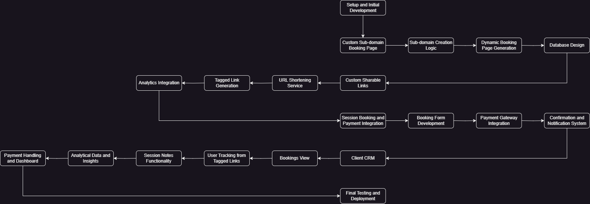

# SaaS Solution for Custom Booking Pages and CRM

## Overview

This SaaS solution provides clients with a platform to manage bookings, payments, and customer interactions. Each client gets access to a custom sub-domain booking page, custom sharable links, session booking with integrated payments, and a powerful CRM.

## Features

### Custom Sub-domain Booking Page

- Dynamically generated booking pages.
- Unique sub-domains for each client.
- Easy-to-use interface for clients and their customers.

### Custom Sharable Links

- Generate custom tagged links similar to Bitly.
- Track link usage and customer inflow.
- Integrated analytics to monitor link performance.

### Session Booking and Payment Integration

- User-friendly booking forms.
- Integrated payment gateway for seamless transactions.
- Confirmation and notification system for bookings.

### Client CRM

- View and manage upcoming bookings.
- Track users from tagged links.
- Write and manage session notes.
- Access analytical data like session frequency, monthly turnover, and other insights.
- Handle payments and display financial data.

## Development Approach

### Tech Stack

- **Frontend**: React.js
- **Backend**: Node.js with Express.js
- **Database**: MongoDB
- **Authentication**: Firebase Authentication or Auth0
- **Payments**: Stripe or PayPal SDK
- **Analytics**: Google Analytics (via Google Firebase if using Firebase Authentication)
- **Hosting**: AWS
- **CI/CD**: GitHub Actions
- **Containerization**: Docker

### Feature Breakdown and Effort Estimation

#### Custom Sub-domain Booking Page

- **Tasks**: Sub-domain creation, dynamic page generation, database schema design.
- **Estimated Time**: 60 hours

#### Custom Sharable Links

- **Tasks**: URL shortening integration, tagged link generation, analytics integration.
- **Estimated Time**: 40 hours

#### Session Booking and Payment Integration

- **Tasks**: Booking form development, payment gateway integration, confirmation system.
- **Estimated Time**: 80 hours

#### Client CRM

- **Tasks**: Bookings view, user tracking, session notes, analytics, payment handling.
- **Estimated Time**: 120 hours

### Total Effort Estimation

- **Total Development Hours**: 300 hours
  - Frontend Development: 110 hours
  - Backend Development: 105 hours
  - Integration and Testing: 50 hours
  - Deployment: 35 hours

### Development Phases

1. **Setup and Initial Development** (Weeks 1-4)

   - Project setup and CI/CD pipeline.
   - Develop and test the custom sub-domain booking page.

2. **Link Generation and Tracking** (Weeks 5-6)

   - Implement custom sharable link generation and tracking analytics.

3. **Booking and Payment Integration** (Weeks 7-10)

   - Develop booking form, integrate payment gateway, and implement confirmation system.

4. **CRM Development** (Weeks 11-14)

   - Build CRM functionalities: bookings view, user tracking, session notes, analytics.

5. **Final Testing and Deployment** (Weeks 15-16)
   - Thorough testing and debugging.
   - Deploy to production environment.

### Risks and Mitigations

1. **Scalability Issues**: Use cloud services like AWS for scalable infrastructure and load balancing.
2. **Security Concerns**: Implement strong authentication (e.g., OAuth), secure payment gateways, and data encryption.
3. **Integration Challenges**: Use well-documented APIs and libraries, and allocate time for testing and debugging.

## Flowchart

